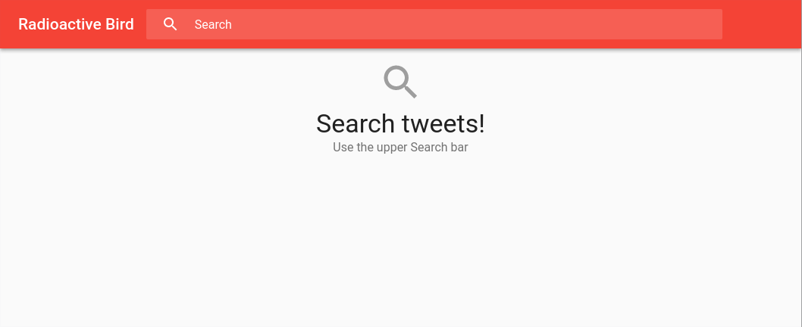
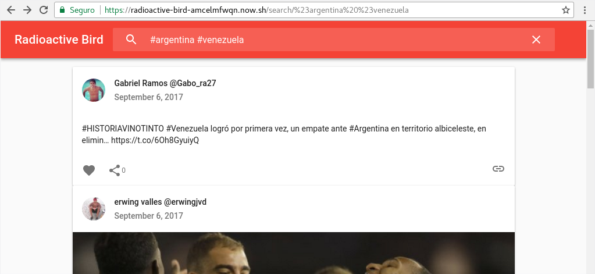
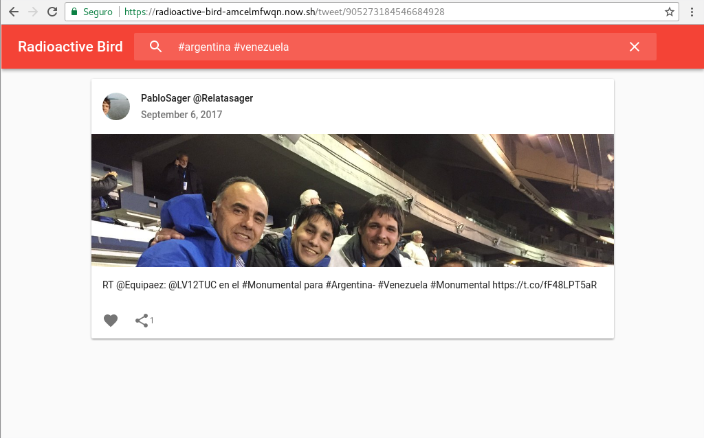
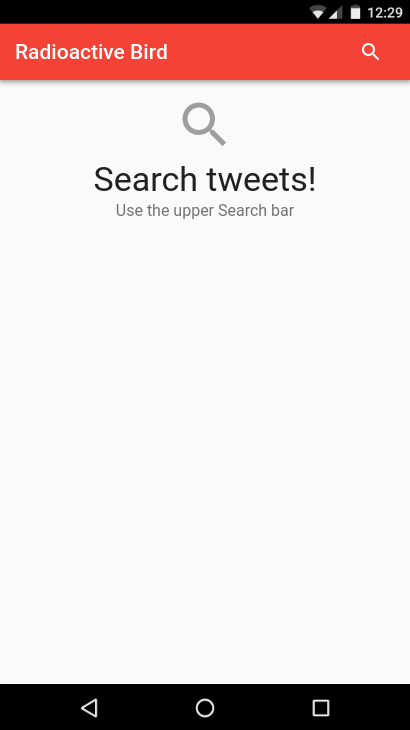
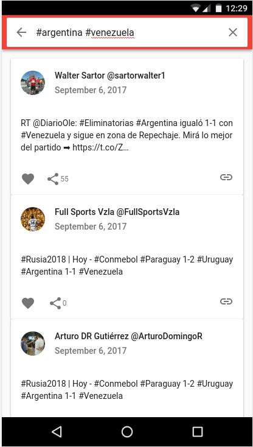
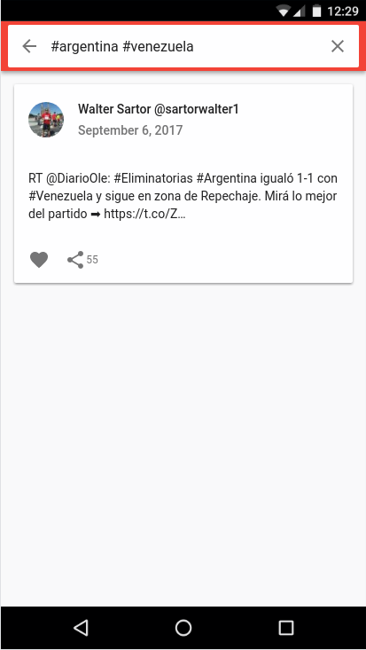

# Radioactive Bird

[See it in action](https://radioactive-bird-amcelmfwqn.now.sh)

A Tiny App that, based on a given keyword parameter, lists the Tweets related to it (Razzle+React+Redux).

A [Razzle ♥](https://github.com/jaredpalmer/razzle) based project.


(Some) Packages / Libraries used:

* [Razzle](https://github.com/jaredpalmer/razzle): [MIT License](https://github.com/jaredpalmer/razzle/blob/master/LICENSE)
* [ReactJS](https://github.com/facebook/react): [BSD License](https://github.com/facebook/react/blob/master/LICENSE)
* [Redux](https://github.com/reactjs/redux): [MIT License](https://github.com/reactjs/redux/blob/master/LICENSE.md)
* [Material UI](https://github.com/callemall/material-ui): [MIT License](https://github.com/callemall/material-ui/blob/v1-beta/LICENSE)
* [ExpressJS](https://github.com/expressjs/express): [MIT License](https://github.com/expressjs/express/blob/master/LICENSE)
* [Serialize Javascript](https://github.com/yahoo/serialize-javascript): [BSD 3-Clause License](https://github.com/yahoo/serialize-javascript/blob/master/LICENSE)
* [Jest](https://github.com/facebook/jest): [BSD 3-Clause License](https://github.com/facebook/jest/blob/master/LICENSE)
* [Prettier](https://github.com/prettier/prettier): [MIT License](https://github.com/prettier/prettier/blob/master/LICENSE)
* [EsLint](https://github.com/eslint/eslint): [MIT License](https://github.com/eslint/eslint/blob/master/LICENSE)
* [Enzyme](https://github.com/airbnb/enzyme): [MIT Lincense](https://github.com/airbnb/enzyme/blob/master/LICENSE.md)

## How to use

Install it and run (development):

```bash
yarn install
mkdir build
yarn start
```

Run (production):

```bash
yarn build
yarn start:prod
```

Run Linters:

```bash
# First Prettier :)
yarn run format
yarn run lint
```

### Docker

```bash
docker build -t radioactive-bird .
docker run -ti --rm -p 3000:3000 -e TWITTER_CONSUMER_KEY=KEY -e TWITTER_CONSUMER_SECRET=SECRET radioactive-bird
```

### Configuration

Environment variables:

* `RAZZLE_CONSUMER_KEY`: Twitter consumer Key (Overrided in runtime by `TWITTER_CONSUMER_KEY`)
* `RAZZLE_CONSUMER_SECRET`: Twitter Consumer secret (Overrided in runtime by `TWITTER_CONSUMER_SECRET`)

Razzle uses _Dotenv_ configuration, the easyest way is to create a `.env.local` file on the root directory:

```bash
cat .env.local
RAZZLE_CONSUMER_KEY=XXXXXXX
RAZZLE_CONSUMER_SECRET=XXXXXX
```

**Note:** Razzle uses webpack to inyect the environment variables values into the source code, this _isn't the best idea_ but for the scope of this example works correctly. If runtime configuration is needed `TWITTER_*` environment variables should be used.

## Deploy to `now`

1. Login: `yarn now login`
2. Add secrets:
  * `yarn now secrets add twitter-consumer-key KEY`
  * `yarn now secrets add twitter-consumer-secret SECRET`
3. Deploy: `yarn now`

## Comments

* As regards testing, most component's test are smoke tests, interactions (simulating _clicking_ events) aren't tested, nor a full snapshot testing was done.
* The build could be further improved, actually the bundle size is high, further investigation regarding _yarn_ dependencies warnings and tree shaking should be done.
* To target diferent data fetching techniques between SSR and Web, webpack's `NormalModuleReplacementPlugin` is used. As the _protocol_ implementation is really short (only two endpoints: _search tweets_ and _fetch tweet_), in SSR the endpoint logic is repeated. Further improvement like importing _express's Route_ and faking a _fetch_ function (for SSR) which simulates api calls could be done (`api` _Route_ test do a simulation of calls, this technique could be re used).
* As regards UI, not all of twitter data is used. Entities such as urls, users and hashtags aren't linked to actual information. In addition, tweets are not linked with page insights. Only images in tweets are implemented. The search only shows the first results, pagination isn't implemented. Not back button was implemented, the app currently relies on the browser's back history.
* A Typecker such as [_flow_](https://flow.org/) could be used to add further static code analisis.
* As regards SEO techniques, only SSR was implemented.
* A deploy pipeline for gitlab ci should be implemented (CI actually run tested, but _now_ deployment wasn't done)
* No PWA techniques were used, Web Workers and _LocalStorage_ could be implemented in order to cache old searchs / tweets and allow the web to be used as an app.

## Screenshots 🎉


Home page in desktop


Search page in desktop


Tweet page in deskop


Home page in mobile


Search page in mobile


Tweet page in mobile
